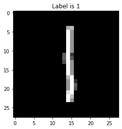
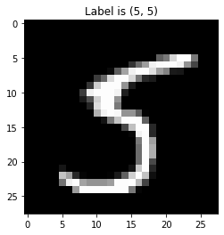

```python
import numpy as np
import pickle
import gzip
import matplotlib.pyplot as plt
import pandas as pd
import numpy as np
import h5py
import sklearn
import sklearn.datasets
import scipy

from PIL import Image
from scipy import ndimage


from keras.models import Sequential
from keras.layers import Dense, Dropout, BatchNormalization, Activation
from keras import regularizers

np.random.seed(7)
import warnings
warnings.filterwarnings("ignore")

%matplotlib inline
```


```python
def load_data():
    f = gzip.open('mnist.pkl.gz', 'rb')
    f.seek(0)
    training_data, validation_data, test_data = pickle.load(f, encoding='latin1')
    f.close()
    return (training_data, validation_data, test_data)
```

how the data looks?


```python
training_data, validation_data, test_data = load_data()
```


```python
training_data
```


    (array([[0., 0., 0., ..., 0., 0., 0.],
            [0., 0., 0., ..., 0., 0., 0.],
            [0., 0., 0., ..., 0., 0., 0.],
            ...,
            [0., 0., 0., ..., 0., 0., 0.],
            [0., 0., 0., ..., 0., 0., 0.],
            [0., 0., 0., ..., 0., 0., 0.]], dtype=float32),
     array([5, 0, 4, ..., 8, 4, 8], dtype=int64))


```python
print("The feature dataset is:" + str(training_data[0]))
print("The target dataset is:" + str(training_data[1]))
print("The number of examples in the training dataset is:" + str(len(training_data[0])))
print("The number of points in a single input is:" + str(len(training_data[0][1])))
```

    The feature dataset is:[[0. 0. 0. ... 0. 0. 0.]
     [0. 0. 0. ... 0. 0. 0.]
     [0. 0. 0. ... 0. 0. 0.]
     ...
     [0. 0. 0. ... 0. 0. 0.]
     [0. 0. 0. ... 0. 0. 0.]
     [0. 0. 0. ... 0. 0. 0.]]
    The target dataset is:[5 0 4 ... 8 4 8]
    The number of examples in the training dataset is:50000
    The number of points in a single input is:784
    

I use the function <i> one_hot </i> to convert the target dataset to one hot encoding.


```python
def one_hot(j):
    # input is the target dataset of shape (1, m) where m is the number of data points
    # returns a 2 dimensional array of shape (10, m) where each target value is converted to a one hot encoding
    # Look at the next block of code for a better understanding of one hot encoding
    n = j.shape[0]
    new_array = np.zeros((10, n))
    index = 0
    for res in j:
        new_array[res][index] = 1.0
        index = index + 1
    return new_array
```


```python
data = np.array([0, 1, 2, 3, 4, 5, 6, 7, 8, 9])
one_hot(data)
```


    array([[1., 0., 0., 0., 0., 0., 0., 0., 0., 0.],
           [0., 1., 0., 0., 0., 0., 0., 0., 0., 0.],
           [0., 0., 1., 0., 0., 0., 0., 0., 0., 0.],
           [0., 0., 0., 1., 0., 0., 0., 0., 0., 0.],
           [0., 0., 0., 0., 1., 0., 0., 0., 0., 0.],
           [0., 0., 0., 0., 0., 1., 0., 0., 0., 0.],
           [0., 0., 0., 0., 0., 0., 1., 0., 0., 0.],
           [0., 0., 0., 0., 0., 0., 0., 1., 0., 0.],
           [0., 0., 0., 0., 0., 0., 0., 0., 1., 0.],
           [0., 0., 0., 0., 0., 0., 0., 0., 0., 1.]])


```python
def data_wrapper():
    tr_d, va_d, te_d = load_data()
    
    training_inputs = np.array(tr_d[0][:]).T
    training_results = np.array(tr_d[1][:])
    train_set_y = one_hot(training_results)
    
    validation_inputs = np.array(va_d[0][:]).T
    validation_results = np.array(va_d[1][:])
    validation_set_y = one_hot(validation_results)
    
    test_inputs = np.array(te_d[0][:]).T
    test_results = np.array(te_d[1][:])
    test_set_y = one_hot(test_results)
    
    return (training_inputs, train_set_y, validation_inputs, validation_set_y)
```


```python
train_set_x, train_set_y, test_set_x, test_set_y = data_wrapper()
```

 let create the desired dataset shapes by taking transpose.


```python
train_set_x = train_set_x.T
train_set_y = train_set_y.T
test_set_x = test_set_x.T
test_set_y = test_set_y.T
```

Now, let's see if the datasets are in the desired shape:


```python
print ("train_set_x shape: " + str(train_set_x.shape))
print ("train_set_y shape: " + str(train_set_y.shape))
print ("test_set_x shape: " + str(test_set_x.shape))
print ("test_set_y shape: " + str(test_set_y.shape))
```

    train_set_x shape: (50000, 784)
    train_set_y shape: (50000, 10)
    test_set_x shape: (10000, 784)
    test_set_y shape: (10000, 10)
    

Now let us visualise the dataset. Feel free to change the index to see if the training data has been correctly tagged.


```python
index  = 1000
k = train_set_x[index+2,:]
k = k.reshape((28, 28))
plt.title('Label is {label}'.format(label= training_data[1][index+2]))
plt.imshow(k, cmap='gray')
```


    <matplotlib.image.AxesImage at 0x2a598dc05c8>





Keras is a framework. So, to implement a neural network model in Keras, we first create an instance of Sequential(). <br>
The Sequential model is a linear stack of layers. We then keep adding Dense layers that are fully connected layers as we desire.<br><br>
We have included Dropout using <i> nn_model.add(Dropout(0.3)) </i> <br><br>
We can also include regularization using the command <br> <i> nn_model.add(Dense(21, activation='relu', kernel_regularizer=regularizers.l2(0.01))) </i> <br>instead of <br> <i> nn_model.add(Dense(21, activation='relu')) </i>


```python
# create model
nn_model = Sequential()
nn_model.add(Dense(35, input_dim=784, activation='relu'))
nn_model.add(Dropout(0.3))
nn_model.add(Dense(21, activation = 'relu'))
nn_model.add(Dense(10, activation='softmax'))
```

Before we run the model on the training datasets, we compile the model in which we define various things like the loss function, the optimizer and the evaluation metric.


```python
nn_model.compile(loss='categorical_crossentropy', optimizer='adam', metrics=['accuracy'])
```

Now, to fit the model on the training input and training target dataset, we run the following command using a minibatch of size 10 and 10 epochs.


```python
nn_model.fit(train_set_x, train_set_y, epochs=10, batch_size=10)
```

    WARNING:tensorflow:From C:\Users\13101\anaconda3\lib\site-packages\keras\backend\tensorflow_backend.py:422: The name tf.global_variables is deprecated. Please use tf.compat.v1.global_variables instead.
    
    Epoch 1/10
    50000/50000 [==============================] - 10s 196us/step - loss: 0.4972 - accuracy: 0.8472
    Epoch 2/10
    50000/50000 [==============================] - 8s 157us/step - loss: 0.3181 - accuracy: 0.9027
    Epoch 3/10
    50000/50000 [==============================] - 8s 152us/step - loss: 0.2854 - accuracy: 0.9126
    Epoch 4/10
    50000/50000 [==============================] - 8s 170us/step - loss: 0.2635 - accuracy: 0.9162
    Epoch 5/10
    50000/50000 [==============================] - 8s 159us/step - loss: 0.2495 - accuracy: 0.9219
    Epoch 6/10
    50000/50000 [==============================] - 8s 167us/step - loss: 0.2429 - accuracy: 0.9231
    Epoch 7/10
    50000/50000 [==============================] - 8s 163us/step - loss: 0.2320 - accuracy: 0.9272
    Epoch 8/10
    50000/50000 [==============================] - 9s 171us/step - loss: 0.2231 - accuracy: 0.9301
    Epoch 9/10
    50000/50000 [==============================] - 8s 152us/step - loss: 0.2215 - accuracy: 0.9285
    Epoch 10/10
    50000/50000 [==============================] - 8s 160us/step - loss: 0.2200 - accuracy: 0.9307
    


    <keras.callbacks.callbacks.History at 0x2a599019b48>


```python
scores_train = nn_model.evaluate(train_set_x, train_set_y)
print("\n%s: %.2f%%" % (nn_model.metrics_names[1], scores_train[1]*100))
```

    50000/50000 [==============================] - 1s 27us/step
    
    accuracy: 96.51%
    

We can see that the model has ~ 97% accuracy on the training dataset.

Now, let's make predictions on the test dataset.


```python
predictions = nn_model.predict(test_set_x)
predictions = np.argmax(predictions, axis = 1)
predictions
```


    array([3, 8, 6, ..., 5, 6, 8], dtype=int64)


```python
scores_test = nn_model.evaluate(test_set_x, test_set_y)
print("\n%s: %.2f%%" % (nn_model.metrics_names[1], scores_test[1]*100))
```

    10000/10000 [==============================] - 0s 25us/step
    
    accuracy: 96.16%
    

We can see that the model has ~96% accuracy on the training dataset.

Try and look at the different test cases and check which all have gone wrong. Feel free to change the index numbers.


```python
index  = 9997
k = test_set_x[index, :]
k = k.reshape((28, 28))
plt.title('Label is {label}'.format(label=(predictions[index], np.argmax(test_set_y, axis = 1)[index])))
plt.imshow(k, cmap='gray')
```


    <matplotlib.image.AxesImage at 0x2a599028208>





```python

```
